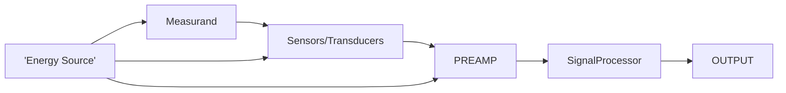

- [ ] bioelectric potential 
is the ionic voltages that are created due to the electrochemical activities in particular cells namely muscle and nerve cells
transducers are used to convert this into electric signals for monitoring biological parameters
The semi permeable nature of an excitable cell membrane may cause imbalance in the concentration of particular ions inside and outside the cell this is what causes ionic voltage buildup

- [ ] polarisation and depolarisation
cells have high concentration of K+ ions inside and Na$^+$ and Cl$^-$ ions outside the cell membrane
ranges from -100mv to -60mv
**Polarized state**
	when a cell has come to rest aka no more ionic transfer is happening 
	resting potential is the membrane potential
	resting potential ranges from -60 to -100mv
**Depolarized State**
	when an ionic trigger occurs(external stimulus moving muscle pain etc) of potential above threshold of -55mV
	The Na$^+$ gated channels open up and allow flooding in of Na$^+$ ions 
	K$^+$ ions flow out too but at a much lower rate
	The net potential inside the cell becomes positive than the outer
	approximately 20mV
	This is considered depolarised state
**Repolarization**
	once the inrush of Na+ ions ends due to the voltage gradient created the voltage gated Na channels close and the membrane returns to original state
	then an active process called sodium pumping transports Na+ ions to the outside of the cell to regain original state of the cell
**Action Potential**
	The potential of a particular cell during which it is depolarizing and repolarizing
	The time period varies with type of cell
	all or nothing any stimulus below the threshold -55mV does not cause any depolarization/action and any stimulus above will trigger it

	stays at -70mV upon stimulus above -55mV Na+ and K+ gates open upon reaching depolarization Gates closes upon falling down the threshold of 0mV active Na+ and K+ pumps stops at -55mV threshold after repolarization slowly climbs and stabilizes at -70mv resting potential
	nerve and muscle cells take 1ms for action potential 
	heart cells takes upto 300ms
	refactory period time taken for the cell to stabilise and get ready for next stimulus 
		absolute:- no stimuli can act
		relative:- follows absolute but a higher amplitude stimuli can cause action
	when a cell is exited and generates an action potential it can act as stimuli for nearby cells and trigger a chain to excite neighbouring cells
	action potentials in a neuron are generated at one end and propagates to the axon on the other end
	no backflow due to refactory period
	rate of propagation through a fiber /cell to cell is called propagation rate
	in nerves propagation rate is also called conduction rate
	range from 20-140m/s
	in heart the rate is 0.2m/s to 0.4m/s
	
- [ ] Nernst equation
	It can be shown that a potential E exists between the inside and outside of a membrane based on the relative activity of the permeable ions in each of the solutions
	This relation is between ionic concentration(activity) and electrode potential
	**half cell potential** is the potential between the two solutions when there is no flow of ions across the membrane
$$
	N E =-(RT/nF)ln(C1F1/C2F2)
$$
	N E - Electric potential/ Nernst potential
	R- Universal Gas Constant 8.71J/K
	T - absolute temp
	n - valence of the electrode material
	F - Faraday Constant 96500C/(mol/valence)
	C1,C2 - concentration of ion1 on either side of the membrane
	F1,F2 - ""
	
- [ ] tissue electrode interface
- electrode
- sweat/electrolyte
- epidermis
- dermis and subcutaneous layers

- [ ] electrical activity of a muscle
- [ ] electrode theory
- biopotential electrodes
	- recording electrodes :- converts ionic current in the body to electronic current in the circuit Non polarizable
	- stimulating electrodes:- converts electronic current in circuit to ionic current in the body/cells Polarizable
- Polarizable electrodes does not allow charge pass through when a current is applied platinum
- non-Polarizable electrodes that allow charge pass through even with current applied AgCl
- **Micro electrodes**
	- Bio electric potential within a single cell
	- smaller size with respect to cell sizes
	- avoids injury
	- doesn't change cell behaviour 
	- size ranges from .05 to 10 $\mu$m
	- **METAL TYPE**:-
		- Solid metal/metal on glass surface
		- stainless steel, platinum-iridium alloy, Tungsten, compound tungsten carbide
		- insulated upto it's tip
		- produced using electrolytic etching
		- larger metallic support shaft
	- **MIcropipette** :-
		- glass within lumen filled with electrolyte
		- prepared from glass capillaries
		- tip drawn out to desired size 1$\mu$m
		- a capillary tube is heated to soften and rapidly stretched
		- electrolyte is usually 3M KCL
		- a metal electrode is then sealed into the pipette

- **skin surface**:-
	- placed in contact with subject's skin
	- **immersion electrode**:-
		- bucket of saline water
	- **Suction type**:-
		- metal plate which no longer needs straps
		- lead contact to a metal cylinder with rubber bulb on the other end and electrolytic gel on the contact end the rubber bulb is squeezed and then the assembly is placed on desired area then the suction holds in it place
		- low contact area large size
	- **metal plate**:-
		- metallic conductor in contact with skin
		- electrolytic pad/gel is used to establish contact
	- **floating electrodes**
		- conductive paste to hold contact
		- double sided adhesive tape ring
- **needle**
	- penetrates skin to get readings
	- unipolar - single wire in needle
	- bi polar - two wire inside
	- coaxial -small gauge hypodermic needle modified to have wires running through it's lumen and insulated using resin, tip is filed to reveal the wire 
	- lead wire into needle insulating coating sharp metallic point

- [x] basic structure of needle electrode
- [x] Half cell potential 
- [x] ECG, EEG, EMG, ERG, EOG, EGG  CONCEPT
- ECG:- bioelectric potential measured from the heart's electrical activity | electrocardiogram
	- two upper two lower chambers the atria and ventricle pairs act together in sync
	- cardiovascular system left atria gets oxygenated blood -> left ventricle -> rest of body via aorta , Right atria gets deoxygenated blood from body -> right ventricle -> lungs
	- They must work in proper time relationship to ensure proper function
	- cardiac excitation :- action potential initiates at top right atrium known as sinoartirial node (SA) ->activates both atria -> terminates at atrioventricular node (AVN) special fibers (delay line) times the signal properly for the ventricles and after the delay line it spreads through Purkinje fibers for activating both ventricles finally terminates at the tip /apex of the heart 
	- [[Module 2]]
- EEG:- potential from brain's electrical activity | Electrp encephalo gram
	- frequency range from 1-30Hz
	- amplitude range 20-100$\mu$V
	- Gamma 30-100HZ motor function, problem solving,concentration
	- Beta 12-30Hz normal walking state ,concentration, five senses, focus
	- Alpha 7.5-12Hz learning, Relaxed, Creative, light meditation, conscious
	- Theta 4-7.5Hz deep meditation, recall, fantasy, Light sleep
	- Delta 0.1-4Hz deep sleep, dreamless sleep, non-REM sleep, unconscious
	- SCALP EEG NON INVASIVE
- EMG:- potential from muscle activity | Electro Musculo Gram
	- needle electrodes
	- flexing and relaxing

- ERG:- potential from retina of the eye | Electro Retino Gram
	- response to stimulus
	- two waves 
	- a - first large negative component (outter  retina)
	- b - corneal positive(inner retina)
	- when light falls outer portion becomes positive and inner part of retina becomes negative
- EOG:- position and movement of the eye | Electro Oculo Gram
	- measure of variation of cornea and retina positions due to movement of eye
	- indirect measure of standing potential in dark and after light rise
- EGG:- Gastric activity | Electro Gastro Gram

- [ ] Biopotential amplifier
- Used to amplify biopotential generated by body at low amplitudes and high source resistance
- increase signal strength while maintaining fidelity
- amplify voltage power and current
- to isolate load from source current gain
- charcteristics:-
	- high input impedance 
	- high cmrr
	- low output impedance
	- highly sensitive to frequency
	- high gain 1000^
	- most are differential

- [x] significance of instrumentation amplifier 
- [ ] working of instrumentation amplifier DIAGRAM
- is a biopotential amplifier 
- designed to overcome 
	- limited input impedance resulting in loading of certain sensors
	- CMRR of 60dB is not enough for modern applications
- Extremely High input impedance 
- very high CMRR
- low power consumption
- available in single IC
- high slew rate
- low bias and offset currents

- uses 3 OP AMPS and 7 resistors
- 4 are to set gain for A3 if equal to 1
- R$_g$ controls gain
- R var to balance out common mode voltage in A3
- A1 and A2 act as buffer amps
$$
Vo/V1-V2 =1+2/a 
$$
- a=Rg/R

- [ ] Need for isolation
- Isolation amplifier are used to provide protection against leakage currents
- they break ohmic continuity between input and output electric signals
- uses separate Voltage sources and Grounds on either side of the isolation barrier
- 
- [ ] isolation amplifier DIAGRAM

- [ ] Man instrument system DIAGRAM

- ENERGY SOURCE - provides required power for operation of various components inside the Intrument
- Measurand - the values to be measured/subject/human to take as readings
- Sensors/Transducers - converts bioelectric potential to electronic current /vice versa to achieve reading of biological factors/induce actions
- calibration - to rectify innate error in sensors 
- Signal Conditioning
	- Pre Amplifier - to amplify the generated signals that are in the range of mV to usable ranges
	- signal Processor - to make required changes to the amplified signal such as scaling zooming to extract maximum data for user
- Control System - User interface to decide and manipulate the way the data is read/interpretted and displayer
- OUTPUT - can be displays, alarms, recorders, transmitters, storage units etc 

[[BIOMED]]
